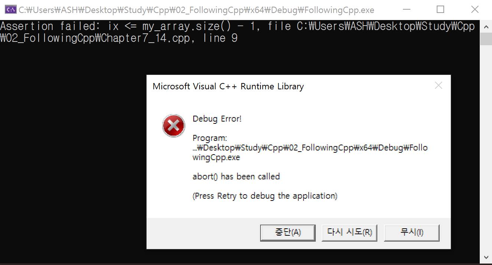
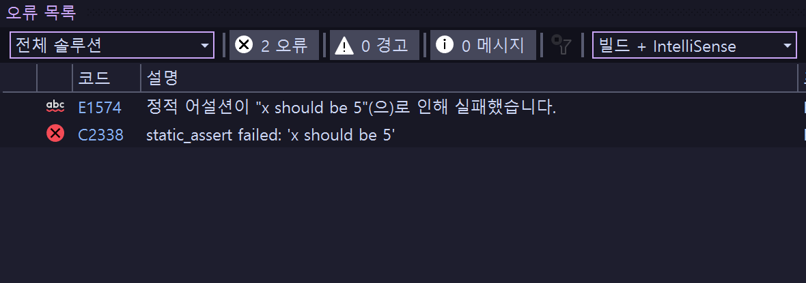

# 단언하기 assert
assert를 이용하여 디버깅을 할때 컴파일러의 도움을 받을 수 있다.

## 사용법
`cassert` 헤더파일을 선언하고 `assert()`안에 필요한 조건을 넣는다.

### ex 1
```cpp
#include <cassert> // assert.h

int main()
{
	assert(false);

	return 0;
}
```

> **조건에 걸린 부분(라인)을 오류 내용과 함께 알려줌<br>**
> **릴리즈 모드에서는 실행되지 않고 디버그 모드에서만 실행됨**

### ex 2
```cpp
int main()
{
	int number = 5;

	// number should be 5
	
	assert(number == 5);

	return 0;
}
```

위 코드에서 문제가 생겼을 때 프로그래머가 직접 `number`가 5인지 확인해봐야 하는데 이럴 필요 없이 `assert`를 남기는 것이 낫다.

> **assert또한 연산이 필요하기 때문에 디버그 모드에서만 실행되고 릴리즈 모드에서는 빼는 것**

### ex 3
```cpp
#include<iostream>
#include <cassert>
#include <array>
using namespace std;

void printValue(const array<int, 5>& my_array, const int& ix)
{
	cout << my_array[ix] << endl;
}

int main()
{
	array<int, 5> my_array{ 1,2,3,4,5 };

	cout << my_array[5] << endl;

	return 0;
}
```

`printValue`를 우리가 만든 api라고 가정을 했을 때, 다른 프로그래머가 `printValue`에 허용되지 않는 숫자를 넣는다고 할 때 직접 찾아가서 5이하의 수를 넣어야 한다고 일일이 말할 수는 없을 것이다. <br>

**이럴 때 `assert`를 사용하여 api를 사용하는 사람에게 정보를 알려줄 수 있다.**

> **잘못된 부분과 위치를 알 수 있음**

### ex 4
```cpp
int main()
{
	const int x = 5;

	static_assert(x == 5, "x should be 5");

	return 0;
}
```

`static_assert`는 컴파일 시점에 오류를 잡아주는 기능을 하고
`static_assert`를 사용하기 위해서는 정적인 데이터를 이용해야 한다.<br>
추가로 오류 에러 메세지를 남길 수 있다.


<br>

>📌 **컴파일러를 이용해서 프로그램이 문제가 생길 여지를 미리 차단할 수 있음**